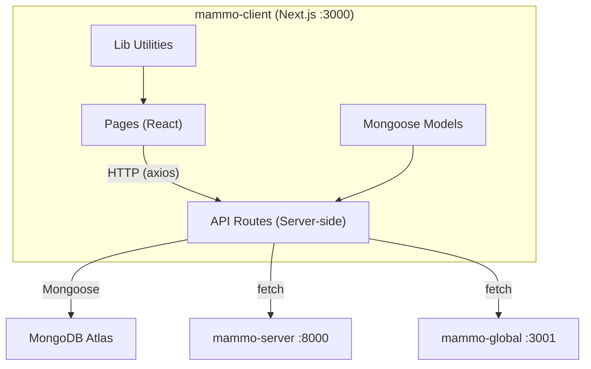
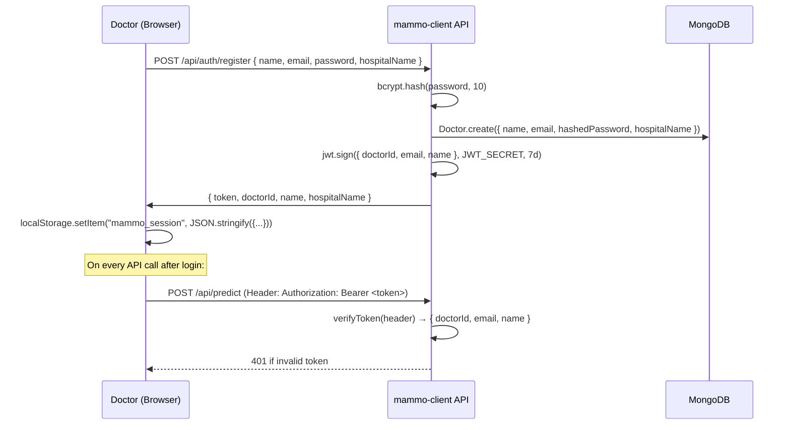

# mammo-client — Complete In-Depth Guide

> **Purpose**: Front-end web application for healthcare professionals to upload mammogram images, get AI predictions, confirm diagnoses for Federated Learning, and view scan history/reports.

---

## 1. Technology Stack

| Technology | Version | Why We Used It |
|---|---|---|
| **Next.js** | 14.2 | Full-stack React framework — gives us both the **front-end UI** (React pages) and **back-end API routes** (`/api/*`) in one project. No need for a separate Express server. Uses **App Router** (new `app/` directory). |
| **React** | 18 | Component-based UI library. Allows reusable components like `GovHeader`, `Banner`, `AshokaChakra`. |
| **TypeScript** | 5 | Type safety — catches bugs at compile time. Every file uses `.ts`/`.tsx` instead of plain `.js`. |
| **MongoDB Atlas** | Cloud | NoSQL cloud database. Stores doctors and predictions. Chosen because it's schema-flexible and free tier is sufficient. |
| **Mongoose** | 9.3 | ODM (Object Document Mapper) for MongoDB — lets us define schemas (`Doctor`, `Prediction`) with TypeScript interfaces and validation. |
| **TailwindCSS** | 3.4 | Utility-first CSS framework — rapid styling with classes like `bg-blue-500`, `text-white`, `rounded-lg`. No separate CSS files needed. |
| **bcryptjs** | 3.0 | Password hashing. When a doctor registers, password is hashed with 10 salt rounds before storing in DB. Never stored in plain text. |
| **jsonwebtoken (JWT)** | 9.0 | Stateless authentication. After login, server signs a JWT with `doctorId`, `email`, `name`. Client stores it in `localStorage` and sends it with every API request as `Bearer <token>`. |
| **axios** | 1.13 | HTTP client — used for API calls from the front-end (nicer API than native `fetch`, with interceptors, timeouts, error typing). |
| **react-dropzone** | 15.0 | Drag-and-drop file upload component for the mammogram image. Handles file validation (accepts only images). |
| **chart.js + react-chartjs-2** | 4.5 / 5.3 | Used in the dashboard for rendering charts (accuracy progression, prediction distribution). |
| **react-hot-toast** | 2.6 | Toast notifications — success/error messages that appear in the corner (e.g., "Prediction complete!", "Login failed"). |

---

## 2. Project Architecture



### Key Architectural Decisions

1. **Next.js API Routes as BFF (Backend-for-Frontend)**: The client NEVER talks directly to `mammo-server`. Instead, the React page calls `/api/predict` (our own Next.js route), which then forwards to FastAPI. This is the **BFF pattern** — it adds a security layer (JWT verification happens here).

2. **Client-side session storage**: JWT token is stored in `localStorage` (not cookies). Simple but effective for a single-domain app.

3. **Singleton MongoDB connection**: `lib/mongoose.ts` caches the connection on `globalThis` to survive Next.js hot-reloads. Without this, you'd get "too many connections" errors during development.

---

## 3. Core Features of mammo-client

Here is an explanation of every major feature implemented in the mammo-client frontend:

### 1. Doctor Authentication & Registration
- **What it is**: Secure login and registration system for healthcare professionals.
- **How it works**: Uses JWT (JSON Web Tokens) for session management and bcrypt for password hashing. When a new doctor registers, they must provide their Hospital Name, which automatically registers that hospital with the `mammo-global` dashboard.
- **Why it matters**: Ensures only authorized personnel can upload sensitive medical images, and links every prediction to a specific doctor and hospital for accountability.

### 2. Mammogram AI Analysis (Scan Page)
- **What it is**: The core interface where doctors drag-and-drop mammogram images (JPEG/PNG/DCM) for AI evaluation.
- **How it works**: The React Dropzone handles the file upload. When the user clicks "Analyze", the image is sent securely via the Next.js API route to the `mammo-server` (FastAPI). The result (Benign or Malignant with confidence percentages) is returned and displayed with color-coded alerts (Red for Malignant, Green for Benign).
- **Why it matters**: Provides an instant, second-opinion AI screening tool to assist radiologists in detecting breast cancer early.

### 3. Federated Learning (FL) Diagnosis Confirmation
- **What it is**: A feedback loop mechanism for the AI model. 
- **How it works**: After receiving the AI's prediction, the doctor is presented with a blue panel asking to "Confirm True Diagnosis". The doctor selects either Benign or Malignant based on their expert finding. This confirmed label is saved to MongoDB and queued on `mammo-server` for the next Federated Learning training round.
- **Why it matters**: This is the heart of the project. It allows the AI model to continuously learn from expert corrections *without* the patient images ever leaving the local hospital (only the model weights are shared globally).

### 4. Cancer Warriors Tribute (Landing Page)
- **What it is**: A dedicated section on the public landing page honoring prominent Indian oncologists (Dr. V. Shanta, Dr. Advani, Dr. Badwe, Dr. Raghu Ram).
- **How it works**: Interactive cards display their portraits, contributions, and awards.
- **Why it matters**: Adds a human element and localized context to the project, recognizing the pioneers of cancer treatment in India.

### 5. Scan History & Reports
- **What it is**: Dashboards where doctors can view their past AI analyses.
- **How it works**: Fetches historical data from MongoDB (using the doctor's JWT to filter only their scans).
- **Why it matters**: Allows doctors to track patient progression over time and refer back to previous AI predictions.

---

## 4. Folder Structure Explained

```
mammo-client/
├── app/                          # Next.js App Router (pages + API routes)
│   ├── page.tsx                  # Landing page (Cancer Warriors, Hero)
│   ├── layout.tsx                # Root layout (html, body, Toaster)
│   ├── globals.css               # Global styles + Tailwind imports
│   ├── login/page.tsx            # Login + Registration page
│   ├── scan/page.tsx             # ★ Core page — upload mammogram, get AI result
│   ├── dashboard/page.tsx        # Doctor's personal dashboard
│   ├── history/page.tsx          # Past scan history table
│   ├── reports/page.tsx          # Reports & analytics
│   ├── help/page.tsx             # Help & documentation
│   └── api/                      # Server-side API routes (run on Node.js)
│       ├── auth/login/route.ts   # POST: authenticate doctor, return JWT
│       ├── auth/register/route.ts# POST: create doctor, hash password, notify global
│       ├── predict/route.ts      # POST: verify JWT → forward image to FastAPI → save result to MongoDB
│       ├── confirm-scan/route.ts # POST: save confirmed diagnosis → send to mammo-server for FL
│       └── history/route.ts      # GET: fetch past predictions for logged-in doctor
├── components/                   # Reusable UI components
│   ├── AshokaChakra.tsx          # Animated spinning Ashoka Chakra SVG
│   ├── Banner.tsx                # Auto-dismissing cancer warriors banner (4s)
│   ├── GovHeader.tsx             # Government-style header with login/logout
│   ├── GovNavbar.tsx             # Navigation bar (Dashboard, New Scan, History, etc.)
│   ├── GovFooter.tsx             # Government-style footer
│   ├── GovLayout.tsx             # Wrapper layout (Header + Navbar + Footer)
│   └── NewsTicker.tsx            # Scrolling news ticker below navbar
├── models/                       # Mongoose schemas
│   ├── Doctor.ts                 # { name, email, password, hospitalName }
│   └── Prediction.ts            # { doctorId, patientCode, prediction, confidence, ... }
├── lib/                          # Shared utilities
│   ├── mongoose.ts               # Singleton MongoDB connection
│   ├── auth.ts                   # Client-side session (get/set/clear in localStorage)
│   ├── verifyToken.ts            # Server-side JWT verification
│   ├── api.ts                    # Axios instance + helper functions
│   └── storage.ts                # Additional storage utilities
├── public/warriors/              # Cancer warrior portrait images
└── .env.local                    # Secrets (MONGODB_URI, JWT_SECRET)
```

---

## 4. API Routes — Deep Dive

### `POST /api/auth/register`
```
Input:  { name, email, password, hospitalName }
Steps:  1. Validate all fields present
        2. Check if email already exists → 409 if duplicate
        3. Hash password with bcrypt (10 rounds)
        4. Create Doctor in MongoDB
        5. Notify mammo-global about the new hospital
        6. Sign JWT (7-day expiry) with { doctorId, email, name, hospitalName }
Output: { token, doctorId, name, email, hospitalName }
```

### `POST /api/auth/login`
```
Input:  { email, password }
Steps:  1. Find doctor by email
        2. Compare password with bcrypt hash
        3. Sign JWT on success
Output: { token, doctorId, name, email, hospitalName }
```

### `POST /api/predict` ★ (Most Important Route)
```
Input:  FormData { file: image, patient_code: string }
Auth:   Bearer JWT (verified via verifyToken.ts)
Steps:  1. Verify JWT → reject 401 if invalid
        2. Forward the image FormData to mammo-server (localhost:8000/predict)
        3. Receive AI prediction { prediction, confidence, benign_prob, malignant_prob }
        4. Save Prediction document to MongoDB (linked to doctorId)
        5. Return result to the React page
Output: { prediction, confidence, benign_prob, malignant_prob, patientCode }
```

### `POST /api/confirm-scan` (FL Pipeline)
```
Input:  { patientId, aiPrediction, confirmedLabel, confidence }
Steps:  1. Create ConfirmedScan document in MongoDB
        2. Forward { patientId, confirmedLabel } to mammo-server/queue-for-training
        3. If mammo-server is offline, scan is saved locally for later
Output: { success: true, scanId, message }
```

### `GET /api/history`
```
Auth:   Bearer JWT
Steps:  1. Verify JWT → extract doctorId
        2. Find all Predictions where doctorId matches, sorted by date
Output: Array of prediction records
```

---

## 5. Authentication Flow



**Why JWT?**
- **Stateless**: No server-side session store needed. The token itself carries the user identity.
- **Expiry**: 7-day expiry means the doctor doesn't have to login every time.
- **Security**: Secret key (`JWT_SECRET`) is only on the server. Token can't be forged.

**Why bcrypt?**
- Passwords are **never stored in plain text**
- `bcrypt.hash(password, 10)` = 10 salt rounds = computationally expensive to brute-force
- `bcrypt.compare()` handles the comparison without ever decrypting

---

## 6. Mongoose Models

### Doctor Schema
```typescript
{
  name:         String,    // "Dr. Vedant Wahane"
  email:        String,    // unique, lowercase, indexed
  password:     String,    // bcrypt hash (never plain text!)
  hospitalName: String,    // "GMCH Nagpur"
  createdAt:    Date,      // auto (timestamps: true)
  updatedAt:    Date       // auto
}
```

### Prediction Schema
```typescript
{
  doctorId:      ObjectId,  // references Doctor._id
  patientCode:   String,    // "PT-87314"
  prediction:    String,    // "Benign" or "Malignant"
  confidence:    String,    // "52.3%"
  benignProb:    String,    // "52.3%"
  malignantProb: String,    // "47.7%"
  modelVersion:  String,    // "ResNet50-FL-v2"
  imageName:     String,    // "test4.png"
  createdAt:     Date
}
```

> **Important**: The actual mammogram image is NOT stored in MongoDB. Only the prediction metadata is stored. The image is sent to FastAPI for inference and discarded — this is by design for **patient privacy**.

---

## 7. Environment Variables

| Variable | Value | Why |
|---|---|---|
| `MONGODB_URI` | `mongodb+srv://...` | Connection string to MongoDB Atlas cloud database |
| `JWT_SECRET` | `mammo_jwt_secret_nmads_2026` | Secret key for signing/verifying JWT tokens. Must be kept private. |

---

## 8. Key Concepts You Should Know

### Q: Why does mammo-client have API routes? Isn't it a front-end?
**A**: Next.js is a full-stack framework. The `app/api/` directory creates **server-side Node.js endpoints**. This acts as a **BFF (Backend-for-Frontend)** — the React pages never talk to mammo-server directly. This adds security (JWT verification), data persistence (MongoDB), and decoupling.

### Q: Why not call mammo-server directly from the browser?
**A**: Three reasons: (1) **Security** — JWT verification happens server-side, (2) **CORS** — browser same-origin policy would block cross-port requests, (3) **Data layer** — we save predictions to our own MongoDB before returning results.

### Q: How does the FL confirmation work?
**A**: After AI predicts, the doctor sees a panel to confirm the true diagnosis. On submit, `confirm-scan` route saves it to MongoDB AND forwards it to `mammo-server/queue-for-training`. The queue accumulates confirmed labels. When `/train` is triggered, the model fine-tunes on these labels and sends weights to mammo-global.

### Q: What happens if mammo-server is offline?
**A**: The `predict` route returns a 503 error with a friendly message. The `confirm-scan` route catches the fetch error and still saves the confirmation locally — it can be synced later.

### Q: Why localStorage for session instead of cookies?
**A**: Simpler implementation for a single-domain app. In production, HTTP-only cookies would be more secure against XSS attacks, but for this project, localStorage is sufficient and easier to debug.

### Q: What is the Singleton pattern in mongoose.ts?
**A**: Next.js recreates modules on hot-reload during development. Without caching, every API call would open a new MongoDB connection, hitting the 100-connection limit. The singleton caches the connection on `globalThis` to reuse across hot-reloads.
